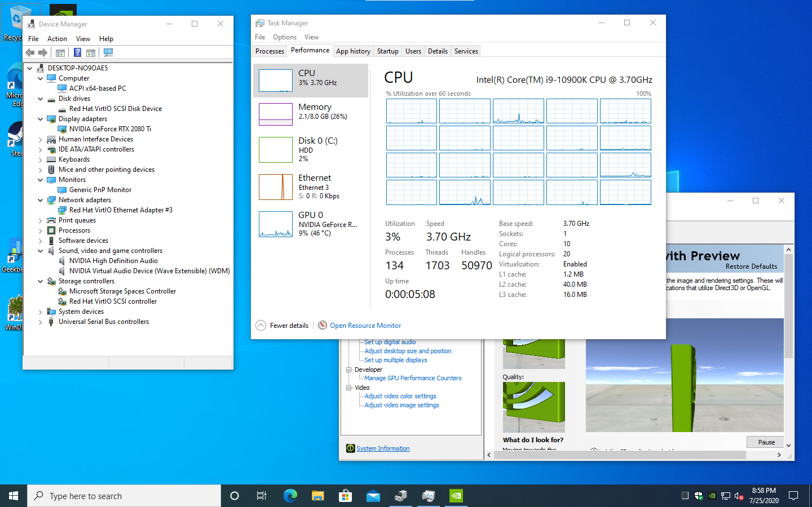

# emu-windows
qemu for windows on docker.
Run / Install / Whatever use for, it's UP On You.

### Request:
./win7.qcow2 - Disk volume

./iso - ISO Folder

./iso/virtio.iso - emu virtio

## Docker-compose
Just Use ```docker-compose up -d```

**docker-compose.yml**
```bash
version: '3.3'
services:
    emu-windows:
        image: emengweb/emu-windows:latest
        privileged: false
        environment:
            - CPU=2 # Default 1
            - MEMERY=3G # Default 1G
            #- ISOFILE=virtio.iso # Default Null, Can set ios for install custem OS
            #- USEKVM=true # if u run as VPS, disable it!!!
        volumes:
            - $PWD/win7.qcow2:/disk.qcow2
            - $PWD/iso:/iso
            - /dev/bus/usb:/dev/bus/usb
            - /lib/modules:/lib/modules
        ports:
            - 6901:5900 # VNC no password
            - 9833:3389 # RDP Administrator password
        devices:
            - /dev/kvm # if u run as VPS, disable it!!!
            - /dev/vfio/vfio
            - /dev/vfio/1
            - /dev/bus/usb
        ulimits:
            memlock:
                soft: -1
                hard: -1
```

## Docker-run

```bash
docker run \
  --volume $PWD/win7.qcow2:/disk.qcow2 `# the persistent volume` \
  --volume $PWD/iso:/iso `# the iso folder` \
  --interactive --tty \
  -p 6901:5900 \
  -p 9833:3389 \
  -e CPU='2' \
  -e MEMERY='3G' \
  -e ISOFILE='virtio.iso' \
  `# -e USEKVM='true'` \
  \
  --device /dev/kvm `# use hardware acceleration` \
  --device /dev/vfio/vfio ` # vfio is used for PCIe passthrough` \
  --device /dev/vfio/1 `# the vfio IOMMU group` \
  --ulimit memlock=-1:-1 `# so DMA can happen for the vfio passthrough` \
  --device /dev/bus/usb `# since we use usb-host device passthrough (note you can specify specific devices too)` \
  --volume /dev/bus/usb:/dev/bus/usb `# to allow for hot-plugging of USB devices` \
  --volume /lib/modules:/lib/modules `# needed for loading vfio` \
  --privileged `# needed for allowing hot-plugging of USB devices, but should be able to replace with cgroup stuff? also needed for modprobe commands` \
  emengweb/emu-windows:latest
```

## Building Dockerfile
```bash
DOCKER_BUILDKIT=1 docker build -t emu-windows .
```

## Create virtual disk
```bash
qemu-img create -f qcow2  disk.qcow2 20G
```


# Inspire by lg/emugaming, many thanks!

Given a QEMU Windows 10 image (you can create one as you normally would, name it `emugaming.qcow2`), this will run it on Docker with GPU/vfio passthrough. Works great for near-native gaming.

Runs on Linux and with some changes should also be able to run on Windows or MacOS hosts (I think MacOS supports VT-d?). Note that you'll need a ROM dump of your GPU if you're passing through the primary boot video card. Also you'll need the kernel parameters `iommu=pt intel_iommu=on` to enable IOMMU/VT-d.

Still working on making stuff actually configurable, but make your modifications in `start.sh` for configuring your components. Ideally in the future you'll be able to just run `docker run lg/emugaming` with hardly any parameters and all will be automatic, including generating the Windows 10 image from MS.

## Building

```bash
DOCKER_BUILDKIT=1 docker build -t emugaming .
```

## Creating Windows 10 image

1. Create a disk image using `qemu-img create -f qcow2 emugaming.qcow2 100G` on the host. You might need the `qemu-img` package.
2. Run the `docker run` command below but appending `ash` at the end to enter the docker image. This will open ash, Alpine's bash equivalent.
3. Download the [latest Windows 10 ISO](https://www.microsoft.com/en-us/software-download/windows10ISO) from Microsoft.
4. Download the [latest stable virtio-win driver pack](https://fedorapeople.org/groups/virt/virtio-win/direct-downloads/stable-virtio/virtio-win.iso) from Fedora or [their github](https://github.com/virtio-win/kvm-guest-drivers-windows).
5. Run a `qemu` command similar to `start.sh`, except:
    - I'd recommend not using the GPU passthrough just yet. Remove the `vfio-pci`, `usb-host`, `vga` and `nographic` lines, and instead pass through `-vnc 0.0.0.0:0 -vga qxl -device usb-tablet` and using VNC to install Windows and getting the image stable.
    - Note you need to mount the two ISOs you downloaded `-cdrom win10.iso -cdrom virtio.iso`
    - When you install Windows it won't see your hard drive, click Have Disk and select the `viostor` driver in the VirtIO driver ISO
    - You can use the `quit` or `system_powerdown` commands in qemu to do a hard shutdown or a soft one
6. Once Windows is installed, I'd recommend some things to change:
    - Disable hibernation and standby (its ok to keep monitor standby on though)
    - Set `bcdedit /set '{current}' recoveryenabled No` since it can get confusing when debugging video card passthrough problems
    - Install the remainder of the Virtio drivers, plus other missing drivers too (like video card)

## Running

```bash
docker run \
  --volume $PWD/emugaming.qcow2:/emugaming.qcow2 `# the persistent volume` \
  --interactive --tty \
  \
  --device /dev/kvm `# use hardware acceleration` \
  --device /dev/vfio/vfio ` # vfio is used for PCIe passthrough` \
  --device /dev/vfio/1 `# the vfio IOMMU group` \
  --ulimit memlock=-1:-1 `# so DMA can happen for the vfio passthrough` \
  --device /dev/bus/usb `# since we use usb-host device passthrough (note you can specify specific devices too)` \
  --volume /dev/bus/usb:/dev/bus/usb `# to allow for hot-plugging of USB devices` \
  --volume /lib/modules:/lib/modules `# needed for loading vfio` \
  --privileged `# needed for allowing hot-plugging of USB devices, but should be able to replace with cgroup stuff? also needed for modprobe commands` \
  emugaming
```

To use the QEMU Monitor command-line:
```bash
docker exec -it <CONTAINER_ID> socat - UNIX-CONNECT:/var/run/qemu_monitor
```

To start this docker image at boot:
```bash
docker run \
  ...
  --detach \
  --restart unless-stopped \
  ...
```

## TODO

- Make GPU params configurable (like address of devices and ROM file)
- Make USB devices passed-through configurable
- Make CPU cores configurable (or autodetect max?)
- Detect and complain when IOMMU isnt on or devices not passthrough-able
- Generate Windows 10 image automatically based on official Microsoft images
- Remove the need for `--privileged` and broad permissions. Should be possible...
- Remove the sleep statement in `start.sh`
- Fix windows launching recover mode
- Get this built for k3s or another Kubernetes distro

## Screenshots

### GPU and CPU passed-through


### Overwatch at 3840x2160 on maxed Epic settings

